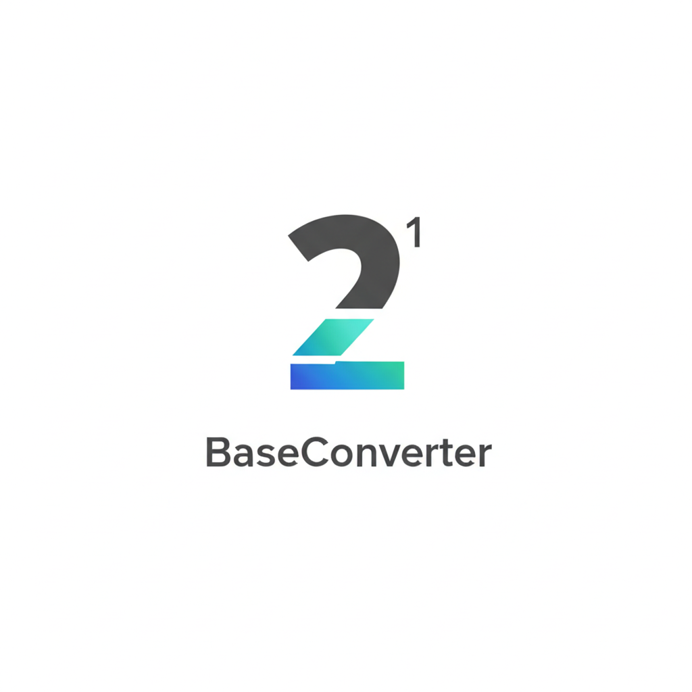

# BaseConverter v0.1



## 项目简介
`BaseConverter` 是一个基于 Go 语言和 Fyne 库开发的进制转换与四则运算工具。它提供了直观的图形用户界面（GUI），允许用户进行不同进制数（2 进制、8 进制、10 进制、16 进制）之间的转换，同时支持在指定进制下进行四则运算。

## 功能特性
1. **进制转换**：支持 2 进制、8 进制、10 进制和 16 进制之间的相互转换。
2. **四则运算**：可以在 2 进制、8 进制、10 进制和 16 进制下进行加、减、乘、除运算。
3. **用户友好界面**：使用 Fyne 库创建了简洁易用的图形界面，方便用户操作。

## 安装与运行

### 环境要求
- Go 1.24 或更高版本
- 安装 Fyne 库所需的系统依赖，具体可参考 [Fyne 官方文档](https://developer.fyne.io/started/#prerequisites)

### 运行步骤
1. 克隆项目仓库到本地：
```bash
git clone https://github.com/your-repo-url/BaseConverter.git
cd BaseConverter
go mod tidy
go run main.go
```

### 打包可执行文件
- 如果你想生成可执行文件，可以使用以下命令：
```bash
fyne package -os windows -icon BaseConverterLogo.png
```
- release中有提供windows系统下的可执行文件